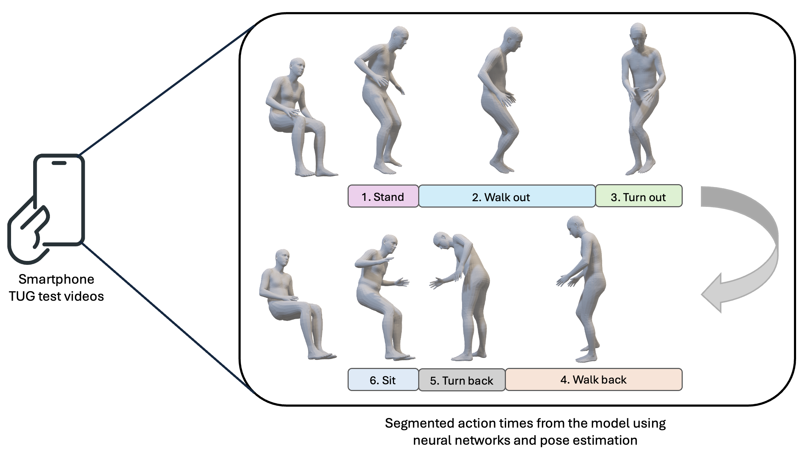

# Automated Subtask Segmentation of the Timed Up and Go Test via Smartphone RGB Videos

## Abstract

The Timed Up and Go (TUG) test is a widely used clinical tool for assessing mobility, frailty, and fall risk, yet its granular subtask segmentation remains underutilized in clinical practice. We present an open-source, state-of-the-art model for automatic TUG subtask segmentation trained exclusively on monocular smartphone videos, establishing the first benchmark of its kind. Existing models relied on training data from RGB-D cameras or motion capture systems, limiting scalability and accessibility. By leveraging ubiquitous smartphone videos, our model democratizes access to detailed biomechanical insights.

Clinically, we demonstrate the predictive value of TUG subtasks for adverse outcomes such as falls and hospital readmissions. Based on 157 smartphone videos captured during TUG tests in our clinic, specific subtasks (e.g., sit-to-stand, walking durations, etc.) significantly enhance risk stratification compared to traditional metrics like total TUG duration or baseline frailty scores. Subtask-based models improved predictive performance (AUC-ROC = 0.747 for falls) beyond standard instruments like the Modified Frailty Index and Risk Analysis Index, validated using logistic regression and 10-fold stratified cross-validation. This work bridges the gap between biomechanics and clinical prediction, providing a scalable and accessible solution to integrate granular mobility metrics into routine care.
